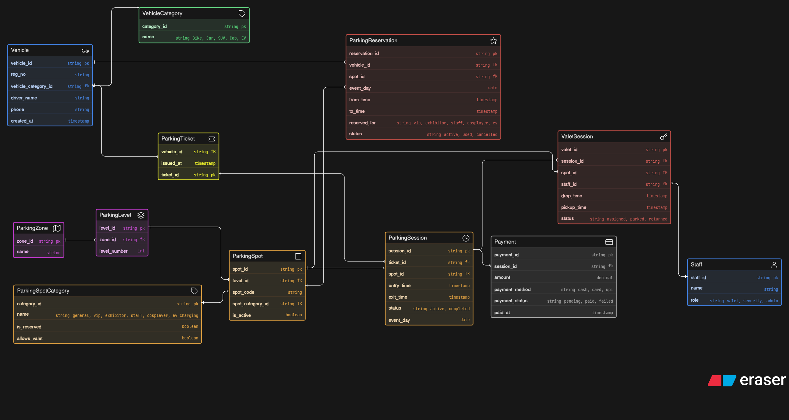

# 🚗 Comic-Con Parking System – ER Diagram

## 📌 Overview

This project is a database design for a multi-zone parking system built for a large-scale event like Comic-Con.

The goal was to handle real-world parking challenges — multiple vehicle types, structured parking (zones & levels), reserved spots, valet services, and high traffic flow — without overcomplicating the schema.

---

## ⚙️ What this system handles

- Vehicles entering multiple times across event days  
- Different vehicle types (bike, car, SUV, EV, etc.)  
- Smart parking spot allocation based on category  
- Multi-level parking (zones → levels → spots)  
- Reserved parking (VIPs, exhibitors, staff, cosplayers)  
- Entry/exit tracking using parking sessions  
- Ticket generation per visit  
- Payment tracking per session  
- Optional valet parking for special cases  
- Reservation system for pre-booked spots  

---

## 🧠 Design Thinking

Instead of putting everything into one table, the system is broken down into logical parts:

- **Vehicle → Ticket → Session** handles the core flow  
- **Zone → Level → Spot** models the physical parking structure  
- **Spot Category** controls rules like reservation and valet access  
- **Session** acts as the source of truth for entry/exit  
- **Valet and Reservation** are kept optional to avoid unnecessary complexity  

The focus was to keep the system:
> scalable, readable, and close to real-world behavior

---

## 🔗 Core Relationships

- One vehicle can have multiple parking sessions  
- One parking spot can be reused across different sessions  
- Each session is linked to one ticket and one payment  
- Parking spots belong to levels, and levels belong to zones  
- Reservations and valet flows are optional but extendable  

---

## 🖼️ ER Diagram

---

## 📚 What I learned

- Separating **session vs ticket vs payment** avoids messy designs  
- Modeling **time-based reuse (parking spots)** is crucial  
- Avoiding over-engineering is as important as handling edge cases  
- Optional features (like valet) should not complicate core flow  
- Good schema design is about **clarity first, optimization later**

---

## 🙌 Final Thoughts

This design is meant to be practical and scalable — something that could realistically support a high-traffic event without becoming hard to maintain.

Not perfect, but intentionally balanced between simplicity and real-world needs.
